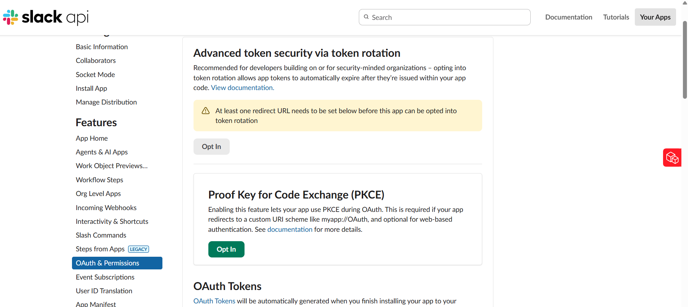
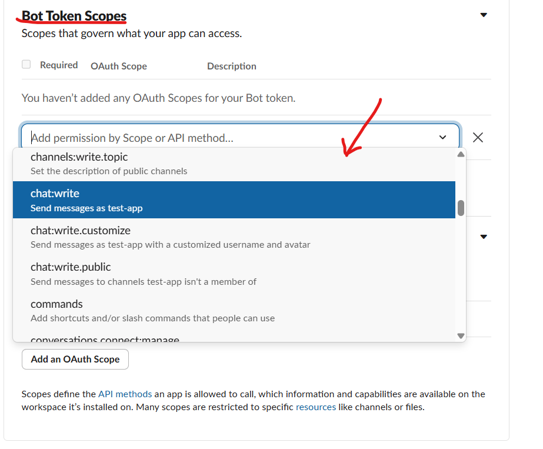
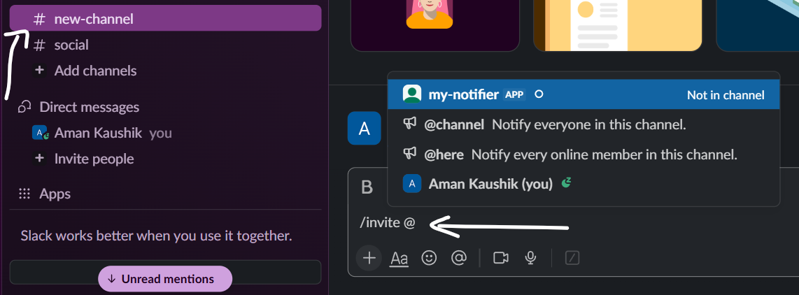

# Credentials Setup

You need four things before the service can run:

| Variable | Source |
|---|---|
| `RETELL_API_KEY` | Retell dashboard |
| `RETELL_FROM_NUMBER` | An E.164 number imported into Retell (optional default for `POST /calls`) |
| `SLACK_BOT_TOKEN` | A Slack app you create |
| `SLACK_ALERT_CHANNEL` | Slack workspace (the channel name without `#`) |

This guide walks through getting each one. Total time: ~15 min.

---

## 1. Slack — Create a bot and get the token

We post alerts via Slack's `chat.postMessage` API, which needs a **Bot User OAuth Token** (`xoxb-…`) and a channel the bot belongs to.

### 1.1 Create a Slack app

1. Go to <https://api.slack.com/apps> and click **Create New App** → **From scratch**.
2. Name it (e.g. `calling-agent-alerts`) and pick the workspace you want alerts in.


### 1.2 Add the `chat:write` bot scope

1. A new Window Will Open. In the left sidebar, open **OAuth & Permissions**.



2. Scroll to **Scopes → Bot Token Scopes** and click **Add an OAuth Scope**.
3. Add `chat:write`.
4. *(Optional, but convenient)* Add `chat:write.public` so the bot can post in public channels without being explicitly invited.



### 1.3 Install the app to your workspace

1. Scroll up on the same page and click **Install to Workspace** (or **Reinstall** if you've changed scopes).
2. Approve the consent screen.
3. After the redirect, copy the **Bot User OAuth Token** — it starts with `xoxb-`. This is your `SLACK_BOT_TOKEN`.


> **Treat the token like a password.** Never commit it. `.env` is already in `.gitignore`.

### 1.4 Invite the bot to your alert channel

1. In Slack, open the channel where alerts should land (e.g. `#alerts`).
2. Type `/invite @<your-app-name>` and confirm.
3. Note the **channel name without the `#`**. That's your `SLACK_ALERT_CHANNEL`.



> If you skipped `chat:write.public` and forget to invite the bot, posts will return `not_in_channel`.

---

## 2. Retell — Get the API key, import a number, and pick an agent

### 2.1 Sign in and grab the API key

1. Go to <https://dashboard.retellai.com> and sign in (or sign up).
2. Open **API Keys** in the dashboard.
3. Click **Create API Key**, name it (e.g. `local-dev`), and copy the value. This is your `RETELL_API_KEY`.

> Retell may only show the key **once**. Save it immediately. If you lose it, revoke and create a new one.

### 2.2 Import / purchase a phone number

Retell requires `from_number` on every call, and that number must be one you've imported or purchased through Retell.

1. Open **Phone Numbers** in the dashboard.
2. Either **Buy a number** (US only on the Retell-purchased path) or **Import** a Twilio / SIP number you already own.
3. Note the number in **E.164** format (e.g. `+14157774444`). This is your `RETELL_FROM_NUMBER`.

### 2.3 Create or pick an agent

You can either bind an agent to your `from_number` (default behaviour — no override needed) or pin a specific agent per call via `override_agent_id`.

1. Open **Agents** in the dashboard.
2. Either create a new agent (set a voice, prompt, response engine, etc.) or open an existing one.
3. Copy the agent's ID from the URL or the agent details panel — e.g. `oBeDLoLOeuAbiuaMFXRtDOLriTJ5tSxD`.

You'll pass this ID in the `override_agent_id` field of `POST /calls` when you want to override the agent bound to your number.

### 2.4 (Optional) Wire up the webhook

If you want real-time Slack alerts on every event, configure the agent's webhook:

1. In the agent's settings, set `webhook_url` to your deployed service's `/webhook/retell` URL — e.g. `https://retell-agent.onrender.com/webhook/retell`.
2. Pick the `webhook_events` you want to subscribe to. The service alerts on every event it receives, so subscribe to whichever subset matters to you (commonly: `call_started`, `call_ended`, `call_analyzed`).

---

## 3. Fill in `.env`

Copy the template and paste the values you collected:

```bash
cp .env.example .env
```

Then edit `.env`:

```env
RETELL_API_KEY=<paste from §2.1>
RETELL_BASE_URL=https://api.retellai.com
RETELL_FROM_NUMBER=<paste from §2.2>

SLACK_BOT_TOKEN=xoxb-<paste from §1.3>
SLACK_BASE_URL=https://slack.com/api
SLACK_ALERT_CHANNEL=<channel name without # from §1.4>
```

That's everything. Head back to the [main README](README.md) to install dependencies and run the server.

---

## Troubleshooting

| Symptom | Cause | Fix |
|---|---|---|
| `401 invalid_auth` from Slack | Wrong token, or you copied the **Signing Secret** instead | Re-copy the **Bot User OAuth Token** (`xoxb-…`) |
| `not_in_channel` from Slack | Bot isn't a member of the target channel | `/invite @<bot>` in that channel, or add `chat:write.public` scope and reinstall |
| `channel_not_found` from Slack | Wrong channel name in `.env` (don't include `#`, don't include the channel ID) | Use the human-readable name, e.g. `alerts` |
| Retell returns `401` | Wrong or revoked API key | Generate a fresh one in §2.1 |
| `400` from `POST /calls` saying `from_number not provided` | `RETELL_FROM_NUMBER` is unset and the request body didn't include `from_number` | Either set `RETELL_FROM_NUMBER` in `.env` or pass `from_number` in the body |
| Retell returns `422 Unprocessable Content` | The `override_agent_id` doesn't exist under your API key, or the `from_number` isn't imported | Verify the agent ID in the dashboard; verify the number is in **Phone Numbers** |
| Retell returns `402 Payment Required` | Trial credit exhausted | Upgrade the account or add a payment method |
